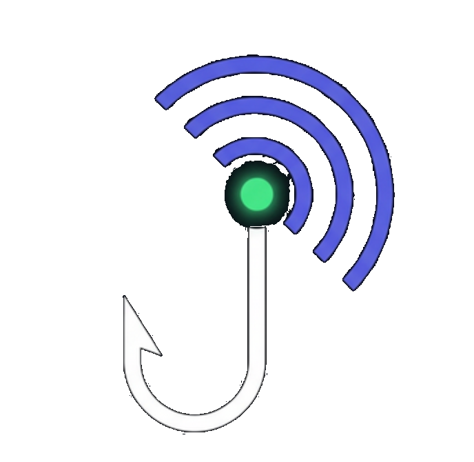

#  HookRadar

### Open Source Webhook Tester & Debugger

> **A spy camera for your webhooks that makes a developer's life easier!**
>
> HookRadar is a free, open-source tool that helps developers test, debug, and analyze webhooks in real-time — without any server setup!

[](LICENSE)
[](https://nodejs.org)
[](https://reactjs.org)
[](CONTRIBUTING.md)

---

## 🤔 What is HookRadar?

**For Developers:**  
HookRadar is an open source webhook inspection tool — instant endpoints, real-time request monitoring, request replay, self-hostable. The free, open source alternative to Webhook.site!

**Simple Explanation:**  
When apps talk to each other automatically over the internet (like Razorpay telling your server "Payment successful!"), HookRadar catches those messages and shows you exactly what was sent — like a spy camera for internet messages.

### The Pizza Analogy 🍕

> You ordered a pizza on Zomato → Paid via Razorpay → Razorpay sends a message to your server: "Payment successful!" → **That's a Webhook!**
>
> Problem: Razorpay is on the internet, but your laptop is on localhost. Razorpay simply can't reach localhost!
>
> **HookRadar Solution:** It gives you a public URL → Razorpay sends the request to this URL → You can see all the data in real-time!

---

## ✨ Features

| Feature | Description |
|---------|-------------|
| 🔗 **Unique Webhook URLs** | Generate unique endpoints to receive webhooks |
| ⚡ **Real-time Dashboard** | Watch incoming requests appear instantly (WebSocket) |
| 🔍 **Payload Inspector** | View headers, body, query params, method, IP, size |
| 📜 **Request History** | All past requests saved & searchable |
| 🔄 **Replay / Forward** | Replay any captured request to another URL |
| 📤 **Auto-Forwarding** | Auto-forward webhooks to your server in real-time |
| 🎨 **Response Customizer** | Set custom status codes, headers, body, and delays |
| 📋 **cURL Export** | One-click cURL command generation for any request |
| 🔎 **Advanced Filters** | Filter by method, status, content-type, date range |
| 🤖 **AI Analysis** | Smart source detection, security audit, code generation |
| 🖥️ **CLI Tool** | Full CLI — `hookradar create`, `hookradar listen` |
| 🌙 **Premium Dark UI** | Beautiful, modern interface with smooth animations |
| 💾 **Persistent Storage** | SQLite database stores all endpoints and requests |
| 🐳 **Docker Ready** | Self-host with a single `docker compose up` |
| 🚀 **Self-hosted** | Run on your own server, own your data |

---

## 🆚 Why HookRadar?

| | Webhook.site | RequestBin | Hookdeck | **HookRadar** |
|---|---|---|---|---|
| **Open Source** | ❌ | ❌ | ❌ | ✅ |
| **Free** | Limited (100 req) | Limited | Paid | ✅ Unlimited |
| **Self-hosted** | ❌ | ❌ | ❌ | ✅ |
| **Real-time** | ✅ | ❌ | ✅ | ✅ |
| **Custom Responses** | Paid | ❌ | ✅ | ✅ |
| **Request Replay** | Paid | ❌ | ✅ | ✅ |
| **Auto-Forwarding** | ❌ | ❌ | ✅ | ✅ |
| **Advanced Filters** | ❌ | ❌ | ✅ | ✅ |
| **AI Analysis** | ❌ | ❌ | ❌ | ✅ |
| **CLI Tool** | ❌ | ❌ | ❌ | ✅ |
| **Docker** | ❌ | ❌ | ❌ | ✅ |

> **Postman vs HookRadar:** Postman = You send requests yourself (You → API). HookRadar = Another server sends requests to you (Razorpay/GitHub → You). Both are complementary tools!

---

## 🛠️ Tech Stack

| Layer | Technology | Purpose |
|-------|-----------|---------|
| Frontend | React 19 + Vite | Dashboard UI |
| Backend | Node.js + Express | API + Webhook receiver |
| Real-time | WebSockets (ws) | Live updates |
| Database | SQLite (better-sqlite3) | Request storage |
| Icons | Lucide React | Beautiful icon set |
| Styling | Vanilla CSS | Premium dark theme |

---

## 🚀 Quick Start

### Prerequisites
- Node.js 18+
- npm

### Installation

```bash
# Clone the repository
git clone https://github.com/aniketmishra-0/hookradar.git
cd hookradar

# Install dependencies
npm install

# Start development server (frontend + backend)
npm run dev
```

**That's it!** Open http://localhost:5173 🎉

### 🐳 Docker (Self-hosting)

```bash
# Using Docker Compose (recommended)
docker compose up -d

# Or build manually
docker build -t hookradar .
docker run -p 3001:3001 -v hookradar-data:/app/data hookradar
```

Open http://localhost:3001

---

## 📡 Usage

### 1. Create an Endpoint
Click **"Create Webhook Endpoint"** → Get a unique URL like `http://localhost:5173/hook/abc123`

### 2. Send Webhooks

```bash
# POST with JSON payload
curl -X POST http://localhost:5173/hook/YOUR_SLUG \
  -H "Content-Type: application/json" \
  -d '{"event": "payment.completed", "amount": 99.99, "currency": "INR"}'

# GET with query parameters
curl "http://localhost:5173/hook/YOUR_SLUG?status=active&page=1"

# PUT request
curl -X PUT http://localhost:5173/hook/YOUR_SLUG \
  -H "Content-Type: application/json" \
  -d '{"name": "Aniket", "role": "admin"}'
```

### 3. Inspect & Debug
- Click any request → See **Headers**, **Body** (auto-formatted JSON), **Query Params**
- Copy **cURL** command to reproduce any request
- View **IP address**, **size**, **response time**, **content type**

### 4. Customize Responses
- **Status Code**: 200, 201, 400, 404, 500, etc.
- **Headers**: Custom response headers (JSON)
- **Body**: Custom response body
- **Delay**: Simulate slow responses (0-30000ms)

### 5. Replay / Forward
Click **"Replay"** on any request → Enter target URL → Forward the exact same request

### 6. Auto-Forwarding
Configure → Set a **Forwarding URL** → All incoming webhooks are automatically forwarded to your server in real-time. HookRadar captures first, then forwards — perfect for dev/staging mirrors.

### 7. Advanced Filters
Click the **filter icon** → Filter by **Method** (GET, POST, PUT...), **Status** (2xx, 4xx, 5xx), **Content-Type**, or **Date Range**.

### 8. AI Analysis
Click **"AI"** button → Get smart source detection, security audit, auto-generated handler code (Node.js/Python), and request pattern insights. Works 100% offline!

### 9. CLI Tool

```bash
# Install globally
npm install -g hookradar

# Create an endpoint
hookradar create -n "My Webhook"

# Listen for webhooks in real-time
hookradar listen <slug>

# Quick create + listen
hookradar quick

# List all endpoints
hookradar list

# View recent requests
hookradar inspect <slug>

# Replay to another URL
hookradar replay <slug> https://your-server.com/webhook

# Server statistics
hookradar stats
```

---

## 📁 Project Structure

```
hookradar/
├── bin/
│   └── hookradar.js         # CLI tool
├── server/
│   ├── server.js            # Express + WebSocket server
│   └── database.js          # SQLite database setup
├── src/
│   ├── components/
│   │   ├── Sidebar.jsx           # Navigation & endpoint list
│   │   ├── Dashboard.jsx         # Home with stats & quick actions
│   │   ├── EndpointView.jsx      # Request list + filters + detail
│   │   ├── RequestDetail.jsx     # Request inspector (tabs)
│   │   ├── ResponseConfig.jsx    # Response + forwarding config
│   │   ├── AIAnalysisPanel.jsx   # AI analysis (4 tabs)
│   │   └── CreateEndpointModal.jsx
│   ├── utils/
│   │   ├── api.js           # API client & utilities
│   │   └── analyzer.js      # AI analysis engine (offline)
│   ├── App.jsx              # Main app with state management
│   ├── main.jsx             # Entry point
│   └── index.css            # Design system (CSS variables)
├── public/
│   └── hookradar-icon.svg   # Logo/favicon
├── Dockerfile               # Docker support
├── docker-compose.yml       # Docker Compose
├── CONTRIBUTING.md          # Contribution guide
├── LICENSE                  # MIT License
└── package.json
```

---

## 🗺️ Roadmap

| Phase | Timeline | Features | Status |
|-------|----------|----------|--------|
| **Phase 1** | Week 1-2 | Backend + Basic UI | ✅ Done |
| **Phase 2** | Week 3-4 | React Dashboard + WebSocket | ✅ Done |
| **Phase 3** | Week 5-6 | Replay, Filter, CLI Tool | ✅ Done |
| **Phase 4** | Month 3-4 | AI Integration (Payload Analysis) | ✅ Done |
| **Phase 5** | Month 2 | Open Source Launch (Product Hunt, Reddit) | ✅ Done |
| **Phase 6** | Ongoing | Community building, Regular releases | 📋 Planned |

### Future Features
- 🔐 **HMAC Signature Verification** — Verify webhook signatures
- 📊 **Analytics Dashboard** — Request trends & patterns
- 🔗 **Team Collaboration** — Share endpoints with team
- 🌍 **Multi-language Support** — Hindi, Spanish, etc.
- 🔔 **Email/Slack Notifications** — Alert on incoming webhooks
- 📱 **Mobile App** — Monitor webhooks on the go

---

## 🤝 Contributing

We welcome contributions of all kinds! Check out our [Contributing Guide](CONTRIBUTING.md).

**You don't need to be a coding expert!** Here are ways to help:
- 🐛 Report bugs
- 📝 Improve documentation
- 🎨 Suggest UI improvements
- 🌐 Translate README
- ⭐ Star the repo!

---

## 📄 License

This project is licensed under the **MIT License** — see the [LICENSE](LICENSE) file for details.

---

## 🙏 Acknowledgments

- [Lucide Icons](https://lucide.dev/) — Beautiful icon set
- [better-sqlite3](https://github.com/WiseLibs/better-sqlite3) — Fast SQLite bindings
- Inspired by Webhook.site, RequestBin, and the developer community

---

<div align="center">

**Made with ❤️ for the developer community**

⭐ **Star this repo if you find it useful!** ⭐

[Report Bug](../../issues) · [Request Feature](../../issues) · [Contributing Guide](CONTRIBUTING.md)

</div>
